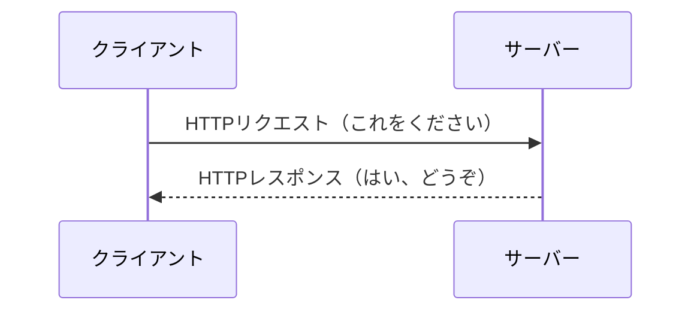

# HTTP プロトコル

> [!abstract] この章が終わったら
> - HTTP リクエストと HTTP レスポンスが、**それぞれ何でできているか**を説明できる
> - **パスパラメータ・クエリパラメータ・ボディパラメータ**の違いを説明できる
> - ステータスコードを見て、**成功したのか、誰が悪いのか**が言える
> - 設計書に書かれたエンドポイントを読んで、**何をする窓口か**が分かる

---

## 1. HTTP は「送り方」の決まりごと

**HTTP（HyperText Transfer Protocol）** は、クライアントとサーバーが情報をやり取りするための**通信規約**です。

やり取り自体はとても単純で、次の 2 つしかありません。



**クライアントが送らない限り、サーバーからは何も来ません。** 必ずリクエストが先です。

---

## 2. HTTP リクエストの構造

リクエストは 3 つの部分でできています。手紙に例えるなら「宛先と用件」「差出人情報」「本文」です。

```
+--------------------------------------------------+
| リクエスト行  |  何を(GET) どこに(/todos) どの版で(HTTP/1.1)
+--------------------------------------------------+
| ヘッダー      |  どのサーバー宛か、何のソフトで送ったか、など
+--------------------------------------------------+
| (空行)        |  ヘッダーとボディの区切り
+--------------------------------------------------+
| ボディ        |  送りたいデータ本体（無いこともある）
+--------------------------------------------------+
```

> [!example]- 講義中にやること
> コマンドプロンプトから実際にリクエストを送り、生の形を見てみます。
> ```bash
> curl -v http://www.google.com
> ```
> `>` で始まる行が送ったリクエスト、`<` で始まる行が返ってきたレスポンスです。

### 2-1. リクエスト行 — 「何を」「どこに」

| 要素 | 意味 | 例 |
| :--- | :--- | :--- |
| **メソッド** | サーバーに何をしてほしいか（動詞） | `GET` `POST` `PUT` `DELETE` |
| **URI** | どのデータに対してか（対象） | `/todos/123` |
| **HTTPバージョン** | どの版の HTTP で話すか | `HTTP/1.1` |

メソッドは 4 つ覚えれば足ります。

| メソッド | してほしいこと |
| :--- | :--- |
| **GET** | データを**取得**する |
| **POST** | データを**新規作成**する |
| **PUT** | 既存のデータを**更新**する |
| **DELETE** | データを**削除**する |

### 2-2. URL の構造

```
 https  ://  example.com  :443  /todos/123  ?limit=10&page=2  #profile
 ~~~~~~      ~~~~~~~~~~~  ~~~~  ~~~~~~~~~~  ~~~~~~~~~~~~~~~~  ~~~~~~~~
1.スキーム    2.ホスト名  3.ポート  4.パス       5.クエリ       6.フラグメント
```

| # | 名前 | 何を表すか | 補足 |
| :--- | :--- | :--- | :--- |
| 1 | **スキーム** | 通信のルール | 研修では `http` |
| 2 | **ホスト名** | サーバーの場所 | ドメイン名または IP アドレス |
| 3 | **ポート番号** | サーバーのどの窓口か | 普通は省略（http は 80、https は 443） |
| 4 | **パス** | サーバー上のどのデータか | `/` から始まる部分 |
| 5 | **クエリ** | 絞り込みや並び替えの条件 | `?` 以降の `key=value` |
| 6 | **フラグメント** | ページ内のどの位置か | **サーバーには送られない** |

> [!note]- ホスト名から IP アドレスを引く仕組み（DNS）
> 人間が覚えやすい `example.com` を、通信に使う `192.0.2.1` に変換する仕組みが
> **DNS（Domain Name System）** です。この変換を「名前解決」と呼びます。
> ```mermaid
> graph LR
>     A[ブラウザ] -- "example.com の IP は？" --> B[DNSサーバー]
>     B -- "192.0.2.1 だよ" --> A
>     A -- "192.0.2.1 にアクセス" --> C[Webサーバー]
> ```

### 2-3. パラメータの 3 種類 ⚠️

**ここは必ず区別できるようにしてください。** 設計書を読むときにも、実装するときにも使います。

| 種類 | どこに書くか | 何に使うか | 例 |
| :--- | :--- | :--- | :--- |
| **パスパラメータ** | パスの一部 | **どれか 1 件を特定する** | `/todos/123` の `123` |
| **クエリパラメータ** | `?` 以降 | **絞り込み・並び替え・ページ指定** | `/todos?limit=10&sort=id` |
| **ボディパラメータ** | ボディ | **送りたいデータ本体** | 登録する todo の中身 |

- パスパラメータは「**123 番の todo**」のように、対象そのものを指す
- クエリパラメータは「**一覧のうち 10 件だけ**」のように、対象への条件を足す
- ボディパラメータは `GET` や `DELETE` では基本使わず、`POST` や `PUT` で使う

### 2-4. ヘッダー

リクエストの付加情報を `キー: 値` の形で並べたものです。

```
Host: example.com
User-Agent: Mozilla/5.0 (Windows NT 10.0; Win64; x64) ...
Accept: application/json
Content-Type: application/json
```

| ヘッダー | 意味 |
| :--- | :--- |
| `Host` | どのホスト宛か |
| `User-Agent` | 何のソフトから送ったか |
| `Accept` | **どの形式で返してほしいか** |
| `Content-Type` | **送っているボディがどの形式か** |

### 2-5. リクエスト全体の例

新しい todo を登録する場合。

```http
POST /todos HTTP/1.1
Host: localhost:8080
Content-Type: application/json

{
  "name": "研修の予習",
  "content": "HTTPの資料を読む"
}
```

- リクエスト行 … `POST` で `/todos` に対して
- ヘッダー … 送るボディは JSON 形式だと宣言
- ボディ … 登録したいデータ本体

---

## 3. HTTP レスポンスの構造

レスポンスもリクエストとほぼ同じ形です。違うのは、1 行目が**要求**ではなく**結果**であることだけ。

```
+--------------------------------------------------+
| ステータス行  |  処理結果がどうだったか（HTTP/1.1 200 OK）
+--------------------------------------------------+
| ヘッダー      |  データの種類、サイズ、など
+--------------------------------------------------+
| (空行)        |
+--------------------------------------------------+
| ボディ        |  要求されたデータ本体（JSON など）
+--------------------------------------------------+
```

### 3-1. ステータスコード

3 桁の数字で結果を表します。**先頭の 1 桁で大枠が決まります。**

| 先頭 | 分類 | ひとことで言うと |
| :--- | :--- | :--- |
| **2xx** | 成功 | うまくいった |
| **3xx** | リダイレクト | 別の場所に移った |
| **4xx** | クライアントエラー | **送ってきた側が悪い** |
| **5xx** | サーバーエラー | **受けた側が悪い** |

課題でよく使うものは次の通りです。

| コード | 名前 | いつ返すか |
| :--- | :--- | :--- |
| **200** | OK | GET・PUT が成功した |
| **201** | Created | POST で新しく作れた |
| **204** | No Content | DELETE が成功した（返すデータが無い） |
| **400** | Bad Request | 入力チェックに引っかかった |
| **404** | Not Found | 指定された ID のデータが無かった |
| **500** | Internal Server Error | プログラムのバグ、DB が落ちている |

> [!tip]- 全一覧（参考）
> https://www.iana.org/assignments/http-status-codes/http-status-codes.xhtml

### 3-2. レスポンス全体の例

`GET /todos/123` に対する応答。

```http
HTTP/1.1 200 OK
Content-Type: application/json

{
  "todoId": 123,
  "name": "研修の予習",
  "content": "HTTPの資料を読む"
}
```

---

## 4. データの形式

ボディで送られるデータには、いくつか書き方の型があります。**Web API では JSON が主流**です。

### JSON

```json
[
  { "id": "111", "name": "Mike",  "country": "USA" },
  { "id": "222", "name": "Nancy", "country": "Canada" }
]
```

- **J**ava**S**cript **O**bject **N**otation の略
- `{}` でひとかたまり、`[]` で並び、`"キー": 値` で中身を書く
- **2か月目に返すのはこの形式です**

> [!note]- 他の形式（参考）
> **CSV** — カンマ区切り。Excel で開ける。構造の入れ子は表せない
> ```
> ID, Name, Country
> 111, Mike, USA
> ```
> **XML** — タグで囲む。HTML に似ていて、入れ子にできる
> ```xml
> <employee>
>     <employ><ID>111</ID><Name>Mike</Name></employ>
> </employee>
> ```

---

## 5. URL は「モノ」、メソッドは「動作」

Web API の URL 設計には、広く使われている考え方があります。

> **URL は「どのデータか（モノ）」を表し、何をするかは「メソッド（動詞）」で表す。**

だから URL に動詞を入れません。

| | 書き方 | なぜ |
| :--- | :--- | :--- |
| ⭕️ | `GET /todos` | 「todo を」「取得する」 |
| ❌ | `GET /getTodos` | 動詞が URL とメソッドで重複している |

あるデータに属するデータは、パスを繋げて表します。

| URL | 意味 |
| :--- | :--- |
| `GET /todos` | todo の一覧 |
| `GET /todos/123` | 123 番の todo |
| `GET /todos/123/tags` | 123 番の todo に付いているタグの一覧 |

絞り込みや並び替えは、パスではなくクエリパラメータで表します。

| URL | 意味 |
| :--- | :--- |
| `GET /todos?limit=10` | todo を 10 件だけ |
| `GET /todos?sort=id_desc` | todo を ID の降順で |
| `GET /todos?name=研修` | 名前に「研修」を含む todo |

> [!important] 設計は与えられます
> 実際にどの URL でどのメソッドを受けるかは、**設計書に書いてあります。**
> ここで覚えてほしいのは設計の仕方ではなく、**設計書を読んで意味が分かること**です。

---

## 6. ここまでの整理

| 知りたいこと | どこを見るか |
| :--- | :--- |
| 何をしようとしているか | リクエストの**メソッド** |
| どのデータに対してか | リクエストの**パス**（＋パスパラメータ） |
| どんな条件が付いているか | **クエリパラメータ** |
| 何を送ってきたか | **ボディ** |
| うまくいったか | レスポンスの**ステータスコード** |
| 結果は何か | レスポンスの**ボディ**（JSON） |

次の回からは、**このリクエストを受け取って、このレスポンスを返すプログラムを
どう作るのか**を見ていきます。
