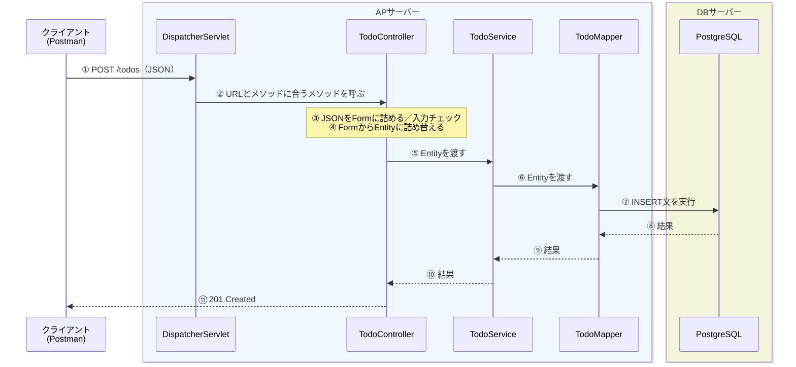

# 課題で作るものの全体像

> [!abstract] この章が終わったら
> - 課題で作る**クラスの名前と役割**が言える
> - リクエストが届いてからレスポンスを返すまで、**どのクラスを順に通るか**を辿れる
>
> **なぜこの形に分けるのかは次の章で扱います。** ここでは「何があるか」だけ掴んでください。

---

## 1. 作るクラスは 3 つ＋データの入れ物

### 主役（処理を書くクラス）

| クラス | 役割 | ひとことで言うと |
| :--- | :--- | :--- |
| **Controller** | リクエストを受け取り、レスポンスを返す | **受付窓口** |
| **Service** | 業務としての処理・判断を行う | **司令塔** |
| **Mapper** | SQL を発行して DB とやり取りする | **DB 担当** |

### 脇役（データを運ぶだけのクラス）

フィールドと getter / setter しか持ちません。**処理は書きません。**

| クラス | 何を入れる箱か | いつ使うか |
| :--- | :--- | :--- |
| **Form** | クライアントから送られてきた値 | 登録・更新（POST / PUT / DELETE） |
| **Entity** | DB のテーブル 1 行分の値 | 全部 |
| **Query** | クライアントから送られてきた検索条件 | 検索（GET） |
| **QueryCondition** | SQL に渡す検索条件 | 検索（GET） |

![[プロジェクト構成の概略図（自分で作る分）.png|400]]

---

## 2. リクエスト 1 本が流れる道すじ

新しい todo を登録する（`POST /todos`）ときの流れです。



### 各ステップで起きていること

| # | 誰が | 何を |
| :--- | :--- | :--- |
| ① | クライアント | JSON をボディに入れて送る |
| ② | **Spring Boot** | URL とメソッドを見て、呼ぶべき Controller のメソッドを決める |
| ③ | **Spring Boot** | JSON を Form オブジェクトに詰め、入力チェックをする |
| ④ | Controller | Form の値を Entity に詰め替える |
| ⑤〜⑥ | Controller → Service → Mapper | Entity を渡していく |
| ⑦ | **MyBatis** | Mapper のメソッドに対応する SQL を実行する |
| ⑧〜⑩ | | 結果が逆順に戻る |
| ⑪ | Controller | ステータスコードを決めて返す |

> [!important] 自分で書くのは一部だけ
> 上の表で**太字になっているところ（②③⑦）は、自分では書きません。**
> Spring Boot と MyBatis が肩代わりしてくれます。
>
> 自分が書くのは、**Controller・Service・Mapper の中身と、箱になるクラスだけ**です。
> 誰が肩代わりしているのかは `06_フレームワークとORマッパー` で見ます。

---

## 3. 層をまたぐときに入れ物が変わる

上の流れをよく見ると、**運ぶ箱が途中で変わっています。**

```
クライアント  →  Controller  →  Service  →  Mapper  →  DB
   JSON          Form              Entity      Entity
                  ↓
              （詰め替え）
                  ↓
                Entity
```

| | Form | Entity |
| :--- | :--- | :--- |
| 何に合わせた形か | **クライアントが送ってくる形** | **DB のテーブルの形** |
| 持っている項目 | リクエストの項目 | テーブルのカラム |
| 誰が詰める | Spring Boot（JSON から自動） | Controller（Form から手で詰め替える） |

検索（GET）のときは、同じ役割を **Query**（クライアントの形）と
**QueryCondition**（SQL に渡す形）が担います。

**なぜ 1 つの箱で済ませないのか。** それが次の章の話です。
