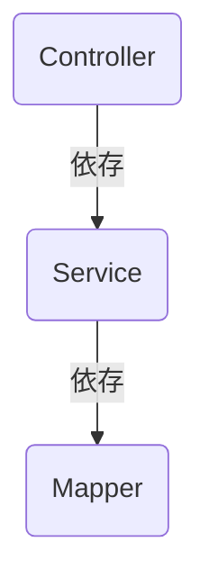

# なぜクラスを分けるのか

> [!abstract] この章が終わったら
> - **レイヤードアーキテクチャ**が何を決めているルールなのかを説明できる
> - クラスを分けないと何が困るのかを、**具体例で**説明できる
> - **凝集度**・**結合度**という言葉の意味が分かる
> - 処理を書くとき「**これはどのクラスに書くべきか**」を自分に問えるようになる

前の章で「Controller・Service・Mapper に分ける」と言いました。この章はその**理由**です。

---

## 1. アーキテクチャ ＝ ひな形

**アーキテクチャ**とは、**システムをどう組み立てるかのひな形**です。

毎回ゼロから「どう設計するか」を考えるのは大変ですし、人によってバラバラな形になります。
「この機能はこの場所に置く」という決まりを先に用意しておくのがアーキテクチャです。

> [!hint]- 間取り図に例えると
> 「リビングはここ、寝室はここ、水回りはまとめてここ」という間取りの型があるように、
> ソフトウェアにも「この処理はこの層に置く」という型があります。

今回使うのは **レイヤードアーキテクチャ（Layered Architecture）** です。

---

## 2. レイヤードアーキテクチャ

システムを**役割ごとの層（Layer）**に分け、それぞれの責任をはっきりさせる考え方です。

| 層 | クラス | 担当すること | 知らなくていいこと |
| :--- | :--- | :--- | :--- |
| プレゼンテーション層 | **Controller** | HTTP の受付とレスポンスの返却 | 業務のルール、SQL |
| ビジネスロジック層 | **Service** | 業務処理・判断 | HTTP、SQL |
| データアクセス層 | **Mapper** | SQL の発行と DB とのやり取り | HTTP、業務のルール |

「**知らなくていいこと**」の列が大事です。各層は自分の仕事だけをします。



依存は**一方向だけ**です。Controller は Service のメソッドを呼びますが、**その逆はありません。**

> [!tip]- 「依存」とは
> あるクラスが別のクラスを使っている状態のことです。
> 今回の文脈では「メソッドを呼び出している」と読んでください。

---

## 3. 分けないと何が起きるか

「分けなくても動くのでは？」——そのとおり、動きます。
困るのは**後から変更が必要になったとき**です。

### 3-1. 全部入りのコード

新規会員登録を、1 つのメソッドに全部書いた例です。

```java
@RestController
public class UserController {

    @Autowired
    private SqlSession sqlSession;

    @PostMapping("/users")
    public ResponseEntity<String> register(@RequestBody Map<String, Object> request) {

        // ① リクエストから値を取り出す（Web の都合）
        String userName = (String) request.get("user_name");
        String email    = (String) request.get("email_address");

        // ② 入力チェック（業務の都合）
        if (userName == null || userName.isEmpty()) {
            return ResponseEntity.badRequest().body("ユーザー名は必須です");
        }
        if (!email.contains("@")) {
            return ResponseEntity.badRequest().body("メールアドレスの形式が不正です");
        }

        // ③ 重複チェック（業務の都合 × DB の都合）
        Integer count = sqlSession.selectOne(
            "SELECT COUNT(*) FROM users WHERE email = #{email}", email);
        if (count > 0) {
            return ResponseEntity.badRequest().body("このメールアドレスは登録済みです");
        }

        // ④ DBへ保存（DB の都合）
        sqlSession.insert("INSERT INTO users (user_name, email) VALUES (#{userName}, #{email})",
            Map.of("userName", userName, "email", email));

        return ResponseEntity.ok("登録完了");
    }
}
```

動きます。ただし、**性質の違う 4 つの都合が 1 つのメソッドに同居しています。**

### 3-2. 困ること① 変更のたびにテスト範囲が広がる

こんな依頼が来たとします。

> **フロントエンドの都合で、JSON のキー名を `user_name` → `username` に変えてほしい**

変更は 1 行です。

```java
String userName = (String) request.get("username");  // ← ここだけ変えたい
```

しかし ①〜④ は**同じメソッドの中**にあり、変数 `userName` は ②③④ でも使われています。
「① を変えただけ」のつもりが、②③④ を壊していないと**言い切れません。**

```
変更した場所　　　：① リクエストのキー名
影響しうる場所　　：② ③ ④（同じ変数・同じメソッドを共有している）
確認が必要な場所　：① ② ③ ④ すべて  ← テスト範囲が広い
```

小さな変更のつもりが、気づかず他を壊してしまうことを **デグレ（デグレード）** と言います。
これを防ぐためのテストも、影響範囲が広いぶん工数がかかります。

**層に分けておくと、こうなります。**

| 変更依頼 | 直す場所 | 触らない場所 |
| :--- | :--- | :--- |
| JSON のキー名を変えたい（Web の都合） | **Controller だけ** | Service / Mapper |
| テーブルのカラム名を変えたい（DB の都合） | **Mapper だけ** | Controller / Service |
| 重複チェックのルールを変えたい（業務の都合） | **Service だけ** | Controller / Mapper |

**「変更の理由ごとに、直す場所が 1 つに決まる」** ——これが層に分ける一番の利点です。

### 3-3. 困ること② 部品を使い回せない

後日、バッチ処理からも同じユーザー登録処理を使いたくなったとします。

```
バッチから使いたい
  ↓
UserController を見る
  ↓
HTTP や @RestController と絡まっていて、切り出せない
  ↓
同じ処理をコピペするしかない → 同じロジックが 2 か所に
```

2 か所にあると、片方を直したときにもう片方を直し忘れます。
Service に処理を集めておけば、バッチからも**同じ Service を呼ぶだけ**で済みます。

> [!hint]- 1か月目の電卓課題で考えると
> 計算式の入力が、コンソールのほかにファイル読み込みにも対応することになったとします。
>
> **入力を受け付けるクラス**と**計算するクラス**を分けていなければ、
> 計算処理をファイル入力側にコピペすることになります。
> そして計算処理にバグが見つかったとき、ファイル入力側の修正を忘れます。
>
> 分けてあれば、ファイル入力側から計算クラスを呼ぶだけです。

![[Pasted image 20260508115311.png|700]]

---

## 4. 分けただけでは足りない ① — 凝集度を高める

ファイルを分けても、**関連する処理があちこちに散らばっていたら意味がありません。**

> [!important] 凝集度とは
> **1 つのクラスの中身が、どれだけ密接に関連し合っているか**を表す言葉です。
> 関連する処理が 1 か所に集まっている状態を「**凝集度が高い**」と言います。

### 4-1. 散らばっている状態

Controller と Service をファイルとしては分けたものの、業務の判定を Controller に書いた例です。

```java
// API から登録する場合
@RestController
public class UserApiController {
    @PostMapping("/users")
    public void register(@RequestBody UserForm form) {
        // ⚠️ 年齢制限の判定がここにある
        if (form.getAge() < 18) {
            throw new IllegalArgumentException("18歳未満は登録できません");
        }
        service.doSomething();
    }
}
```

```java
// ファイルから登録する場合
public class UserFileImporter {
    public void importFromCsv(File file) {
        // ⚠️ まったく同じ判定がここにもある
        if (ageFromCsv < 18) {
            return;
        }
        service.doSomething();
    }
}
```

ここに「**登録可能年齢を 18 歳から 20 歳に変更してほしい**」と来たら、**2 か所とも**直す必要があります。
入口が増えるほど散らばり、1 か所でも直し忘れればバグになります。

### 4-2. 集まっている状態

判定を **Service の 1 メソッドにだけ**書きます。

```java
@Service
public class UserService {

    // 年齢の判定はここにしか無い
    private void validateAge(Integer age) {
        if (age < 18) {
            throw new IllegalArgumentException("18歳未満は登録できません");
        }
    }

    public void register(UserForm form) {
        validateAge(form.getAge());   // 呼ぶだけ
    }

    public void update(Integer id, UserForm form) {
        validateAge(form.getAge());   // 呼ぶだけ（コピーしない）
    }
}
```

年齢が変わっても、直すのは `validateAge` の 1 か所だけです。

> [!important] 処理を書くときに問うこと
> **「この処理は、どのクラスに書くべきか」**
> 手が動くところに書くのではなく、**同じ種類の処理がすでにある場所**に書いてください。

---

## 5. 分けただけでは足りない ② — 結合度を下げる

もう 1 つ、**クラス同士のつながり方**も問題になります。

> [!important] 結合度とは
> **クラス同士のつながりの強さ**です。
> あるクラスが別の**具体的なクラスを直接知っている**状態を「**結合度が高い（密結合）**」と言います。

### 5-1. つながりが強すぎる状態

```java
public class UserService {
    private final UserMapperImpl userMapper;

    public UserService() {
        this.userMapper = new UserMapperImpl();  // ← 自分で作っている
    }
}
```

`UserService` は `UserMapperImpl` という**具体的なクラスを名指しで知っています。**
この状態だと、

- **差し替えられない** — DB の代わりに別の保存先を使いたくなっても、`UserService` を書き換えるしかない
- **テストしづらい** — `UserService` を試すたびに、本物の DB が必要になる

### 5-2. つながりを緩める：インターフェースに依存する

まず「**何ができるか**」だけをインターフェースで決めます。

```java
// 何ができるかだけを決める
public interface UserMapper {
    User findById(Integer id);
}
```

`UserService` は、**インターフェースの型で**受け取ります。

```java
public class UserService {
    private final UserMapper userMapper;   // インターフェース型で持つ

    // 自分で作らず、外から受け取る
    public UserService(UserMapper userMapper) {
        this.userMapper = userMapper;
    }
}
```

こうしておくと、`UserMapper` を実装したものなら何でも渡せます。

```java
// 本番用：実際に DB につなぐ
public class UserMapperImpl implements UserMapper { ... }

// テスト用：DB を使わず、決まった値を返す
public class MockUserMapper implements UserMapper {
    @Override
    public User findById(Integer id) {
        return new User(id, "テストユーザー");
    }
}
```

**`UserService` のコードは 1 行も変えずに、中身を差し替えられます。**

### 5-3. 目指す状態

| | 望ましい | 問題がある |
| :--- | :--- | :--- |
| **凝集度** | 関連する処理が 1 か所に集まっている | あちこちに散らばっている |
| **結合度** | インターフェース越しに緩くつながる | 具体的なクラスを直接知っている |

> **高凝集・低結合**。クラスの中は密に、クラスの間は緩く。

---

## 6. Form と Entity を分ける理由

前章で「層をまたぐと入れ物が変わる」と書きました。これも同じ考え方です。

```java
// Form：クライアントが送ってくる形
public class UserForm {
    private String userName;
    private String email;
    private String password;         // ← 平文。DB には保存しない
    private String passwordConfirm;  // ← 確認用。DB には保存しない
}

// Entity：DB のテーブルの形
public class UserEntity {
    private Integer id;              // ← 自動採番。クライアントは送ってこない
    private String name;
    private String email;
    private String passwordHash;     // ← ハッシュ化済み。Form には無い
    private LocalDateTime createdAt; // ← 登録日時。クライアントは送ってこない
}
```

**クライアントが送ってくるものと、DB に入っているものは、そもそも一致しません。**

1 つのクラスで兼用すると、

- 画面の項目が増えるたびに、DB 用のクラスが変わる
- テーブルにカラムが増えるたびに、API の仕様が変わる

分けておけば、**片方の変更がもう片方に届きません。** これも「変更を層の中に閉じ込める」話です。

---

## 7. 分けることのコスト

ここまで利点を見てきましたが、**分けることにはコストもあります。**

- ファイルが増え、処理を追うときに開く場所が増える
- 小さな機能でも Controller / Service / Mapper の 3 ファイルが必要になる
- チームで「どこに何を書くか」の共通認識が無いと、かえって混乱する

**「とにかく分ければ良い」ではありません。**
小さな試作コードに 3 層をあてはめても、複雑になるだけです。

> システムの規模・人数・変更の頻度に応じて、適切な粒度を選ぶのが本来の設計です。
> 今回は実務でよく使われる 3 層構成で、**分ける感覚を掴む**ことを目的にします。

---

## 8. まとめ

```
目標：仕様が変わったとき、安全に・早く直せるシステム
  ↓
手段：レイヤードアーキテクチャ（3層）でクラスを分ける
  ↓
① 凝集度を高める … 関連する処理は 1 か所に集める
                    → 直す場所が 1 つに決まる
  ↓
② 結合度を下げる … インターフェース越しに緩くつなぐ
                    → 差し替えとテストが楽になる
```

| やること | なぜ |
| :--- | :--- |
| Controller / Service / Mapper に分ける | 変更の影響を層の中に閉じ込めるため |
| 処理を Service に集める（高凝集） | 「直すのはここだけ」の状態を作るため |
| インターフェース越しに依存する（低結合） | 差し替えとテストを楽にするため |
| Form と Entity を分ける | API の仕様と DB の構造を互いに影響させないため |

---

## 9. 積み残した問題

`§5-2` で、`UserService` は `UserMapper` を**自分で作らず、外から受け取る**形にしました。

```java
public UserService(UserMapper userMapper) {
    this.userMapper = userMapper;
}
```

ではその「外」とは誰でしょうか。**誰かが `UserMapperImpl` を作って、`UserService` に渡さなければなりません。**
そしてその誰かは、`UserService` も作って `UserController` に渡す必要があります。

課題のコードを見ても、そんな処理はどこにも書きません。**それでも動きます。**

**誰が作って、誰が渡しているのか。** 次の章で見ていきます。
