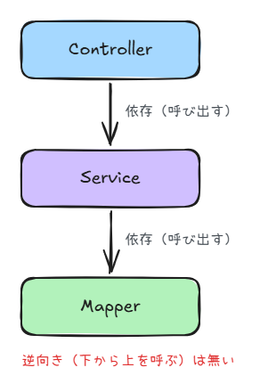
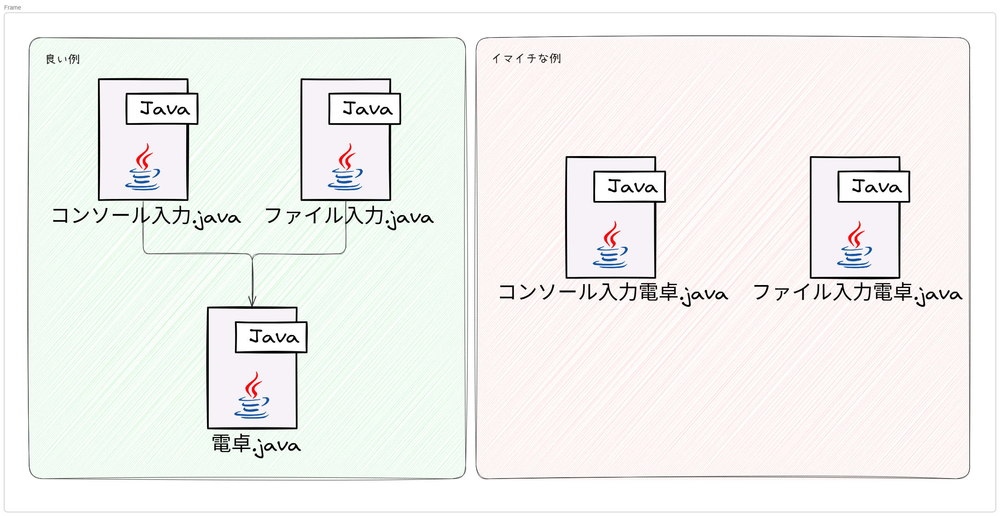

# なぜクラスを分けるのか

> [!abstract] この章が終わったら
> - **レイヤードアーキテクチャ**が何を決めているルールなのかを説明できる
> - クラスを分けないと何が困るのかを、**具体例で**説明できる
> - **凝集度**・**結合度**という言葉の意味が分かる
> - 処理を書くとき「**これはどのクラスに書くべきか**」を自分に問えるようになる

前の章で「Controller・Service・Mapper に分ける」と言いました。この章はその**理由**です。

---

## 1. アーキテクチャ ＝ ひな形

**アーキテクチャ**とは、**システムをどう組み立てるかのひな形**です。

毎回ゼロから「どう設計するか」を考えるのは大変ですし、人によってバラバラな形になります。
「この機能はこの場所に置く」という決まりを先に用意しておくのがアーキテクチャです。

> [!hint]- 間取り図に例えると
> 「リビングはここ、寝室はここ、水回りはまとめてここ」という間取りの型があるように、
> ソフトウェアにも「この処理はこの層に置く」という型があります。

今回使うのは **レイヤードアーキテクチャ（Layered Architecture）** です。

---

## 2. レイヤードアーキテクチャ

システムを**役割ごとの層（Layer）**に分け、それぞれの責任をはっきりさせる考え方です。

| 層 | クラス | 担当すること | 知らなくていいこと |
| :--- | :--- | :--- | :--- |
| プレゼンテーション層 | **Controller** | HTTP の受付とレスポンスの返却 | 業務のルール、SQL |
| ビジネスロジック層 | **Service** | 業務処理・判断 | HTTP、SQL |
| データアクセス層 | **Mapper** | SQL の発行と DB とのやり取り | HTTP、業務のルール |

「**知らなくていいこと**」の列が大事です。各層は自分の仕事だけをします。



依存は**一方向だけ**です。Controller は Service のメソッドを呼びますが、**その逆はありません。**

> [!tip]- 「依存」とは
> あるクラスが別のクラスを使っている状態のことです。
> 今回の文脈では「メソッドを呼び出している」と読んでください。

---

## 3. 分けないと何が起きるか

「分けなくても動くのでは？」——そのとおり、動きます。
困るのは**後から変更が必要になったとき**です。

### 3-1. 全部入りのコード

新規会員登録を、1 つのメソッドに全部書いた例です。

```java
@RestController
public class UserController {

    @Autowired
    private JdbcTemplate jdbcTemplate;

    @PostMapping("/users")
    public ResponseEntity<String> register(@RequestBody Map<String, Object> request) {

        // ① リクエストから値を取り出す（Web の都合）
        String userName = (String) request.get("user_name");
        String email    = (String) request.get("email_address");

        // ② 入力の形式チェック（Web の都合）
        if (userName == null || userName.isEmpty()) {
            return ResponseEntity.badRequest().body("ユーザー名は必須です");
        }
        if (email == null || !email.contains("@")) {
            return ResponseEntity.badRequest().body("メールアドレスの形式が不正です");
        }

        // ③ 重複チェック（業務の都合 × DB の都合）
        Integer count = jdbcTemplate.queryForObject(
            "SELECT COUNT(*) FROM users WHERE email = ?", Integer.class, email);
        if (count > 0) {
            return ResponseEntity.badRequest().body("このメールアドレスは登録済みです");
        }

        // ④ DBへ保存（DB の都合）
        jdbcTemplate.update("INSERT INTO users (name, email) VALUES (?, ?)", userName, email);

        return ResponseEntity.status(HttpStatus.CREATED).body("登録完了");
    }
}
```

動きます。ただし、**Web・業務・DB という性質の違う都合が 1 つのメソッドに同居しています。**

### 3-2. 困ること① 変更のたびにテスト範囲が広がる

こんな依頼が来たとします。

> **DB の都合で、テーブルのカラム名を `name` → `user_name` に変えたい**

直すのは ④ の SQL 1 行です。

```java
jdbcTemplate.update("INSERT INTO users (user_name, email) VALUES (?, ?)", userName, email);
```

コードを変えたら、壊していないか**確かめる（テストする）**必要があります。
ところが ④ は `register()` の中にあり、**④ だけを動かす方法がありません。**
確かめるには HTTP でリクエストを送り、② の形式チェックを通し、③ で重複しないメールアドレスを用意して、やっと ④ にたどり着きます。

```
変更の理由　　　　：DB の都合（カラム名）
変更したメソッド　：register()  ← Web・業務・DB が同居している
確認が必要な範囲　：register() 全体（① ② ③ を通さないと ④ を確かめられない）
```

変更の理由は DB だけなのに、**確かめる範囲は Web と業務まで広がります。**

**層に分けておくと、こうなります。**

| 変更依頼                         | 直す場所＝テスト範囲               | 触らない場所               |
| :--------------------------- | :----------------------- | :------------------- |
| JSON のキー名を変えたい（Web の都合）      | **Controller 側（Form）だけ** | Service / Mapper     |
| テーブルのカラム名を変えたい（DB の都合）       | **Mapper だけ**            | Controller / Service |
| メールアドレスの大文字・小文字を区別しない（業務の都合） | **Service だけ**           | Controller / Mapper  |

今回のカラム名の変更なら、直すのも確かめるのも Mapper の SQL だけです。
Controller と Service は SQL を知らない（§2 の「知らなくていいこと」）ので、影響しようがありません。

**「変更の理由ごとに、直す場所が 1 つに決まり、テスト範囲が狭まる」** ——これが層に分ける一番の利点です。

### 3-3. 困ること② 部品を使い回せない

後日、ファイル入力でも同じユーザー登録処理を使いたくなったとします。

```
ファイル読み込みから使いたい
  ↓
UserController を見る
  ↓
HTTP や @RestController と絡まっていて、切り出せない
  ↓
同じ処理をコピペするしかない → 同じロジックが 2 か所に
```

2 か所にあると、片方を直したときにもう片方を直し忘れます。
Service に処理を集めておけば、バッチからも**同じ Service を呼ぶだけ**で済みます。

> [!hint]- 1か月目の電卓課題で考えると
> 計算式の入力が、コンソールのほかにファイル読み込みにも対応することになったとします。
>
> **入力を受け付けるクラス**と**計算するクラス**を分けていなければ、
> 計算処理をファイル入力側にコピペすることになります。
> そして計算処理にバグが見つかったとき、ファイル入力側の修正を忘れます。
>
> 分けてあれば、ファイル入力側から計算クラスを呼ぶだけです。



計算式の入力方式が増えれば増えるだけ計算ロジックはコピペされ、計算ロジックの変更の手間が大きくなったり、変更漏れも発生します。
また、二重、三重管理にしていると、それぞれのロジックが独自に少しずつ進化し始め、入力方式も計算ロジックに絡まり始めます。そうなるともう同じ計算ロジックであったはずなのに、別のプログラムになってしまうため、変更が大変です。

---

## 4. 分けただけでは足りない ① — 凝集度を高める

ファイルを分けても、**関連する処理があちこちに散らばっていたら意味がありません。**中身も伴わないと、ファイルの名前を単に分けただけになってしまいます。

> [!important] 凝集度とは
> **1 つのクラスの中身が、どれだけ密接に関連し合っているか**を表す言葉です。
> 関連する処理が 1 か所に集まっている状態を「**凝集度が高い**」と言います。

### 4-1. 散らばっている状態

Controller と Service をファイルとしては分けたものの、業務の判定を Controller に書いた例です。

```java
// API から登録する場合
@RestController
public class UserApiController {
    @PostMapping("/users")
    public void register(@RequestBody UserForm form) {
        UserEntity user = toEntity(form);
        // ⚠️ 年齢制限の判定がここにある
        if (user.getAge() < 18) {
            throw new IllegalArgumentException("18歳未満は登録できません");
        }
        userService.register(user);
    }
}
```

```java
// ファイルから登録する場合
public class UserFileImporter {
    public void importFromCsv(File file) {
        for (UserEntity user : readUsers(file)) {
            // ⚠️ まったく同じ判定がここにもある
            if (user.getAge() < 18) {
                throw new IllegalArgumentException("18歳未満は登録できません");
            }
            userService.register(user);
        }
    }
}
```

ここに「**登録可能年齢を 18 歳から 20 歳に変更してほしい**」と来たら、**2 か所とも**直す必要があります。
入口が増えるほど散らばり、1 か所でも直し忘れればバグになります。

### 4-2. 集まっている状態

判定を、どの入口からも通る **Service の `register` にだけ**書きます。

```java
@Service
public class UserService {

    public void register(UserEntity user) {
        // 年齢の判定はここにしか無い
        if (user.getAge() < 18) {
            throw new IllegalArgumentException("18歳未満は登録できません");
        }
        userMapper.insert(user);
    }
}
```

入口の側は、判定を書かずに呼ぶだけです。

```java
// API から登録する場合（UserApiController）
userService.register(toEntity(form));

// ファイルから登録する場合（UserFileImporter）
userService.register(user);
```

年齢が変わっても、直すのは `UserService` の 1 か所だけです。入口がいくつ増えても変わりません。

> [!important] 処理を書くときに問うこと
> **「この処理は、どのクラスに書くべきか」**
> 手が動くところに書くのではなく、**同じ種類の処理がすでにある場所**に書いてください。

---

## 5. 分けただけでは足りない ② — 結合度を下げる

もう 1 つ、**クラス同士のつながり方**も問題になります。

> [!important] 結合度とは
> **クラス同士のつながりの強さ**です。
> あるクラスが別の**具体的なクラスを直接知っている**状態を「**結合度が高い（密結合）**」と言います。

### 5-1. つながりが強すぎる状態

```java
public class UserService {
    private final UserMapperImpl userMapper;

    public UserService() {
        this.userMapper = new UserMapperImpl();  // ← 自分で作っている
    }
}
```

`UserService` は `UserMapperImpl` という**具体的なクラスを名指しで知っています。**
この状態だと、

- **差し替えられない** — DB の代わりに別の保存先を使いたくなっても、`UserService` を書き換えるしかない。来月からoracleのライセンス料が高くなり、postgreに乗り換えたくなったらどうしましょう？
- **テストしづらい** — `UserService` を試すたびに、本物の DB が必要になる。毎回DBのテストデータを用意してテストするのは大変です。

### 5-2. つながりを緩める：インターフェースに依存する

まず「**何ができるか**」だけをインターフェースで決めます。

```java
// 何ができるかだけを決める
public interface UserMapper {
    UserEntity findById(Integer id);
}
```

`UserService` は、**インターフェースの型で**受け取ります。

```java
public class UserService {
    private final UserMapper userMapper;   // インターフェース型で持つ

    // 自分で作らず、外から受け取る
    public UserService(UserMapper userMapper) {
        this.userMapper = userMapper;
    }
}
```

こうしておくと、`UserMapper` を実装したものなら何でも渡せます。

```java
// 本番用：実際に DB につなぐ
public class UserMapperImpl implements UserMapper { ... }

// テスト用：DB を使わず、決まった値を返す
public class MockUserMapper implements UserMapper {
    @Override
    public UserEntity findById(Integer id) {
        UserEntity user = new UserEntity();
        user.setId(id);
        user.setName("テストユーザー");
        return user;
    }
}
```

**`UserService` のコードは 1 行も変えずに、中身を差し替えられます。**

ここでは仕組みを見るために `UserMapperImpl` を手で書きましたが、**課題では書きません。**
MyBatis が用意してくれます（次の章）。

### 5-3. 目指す状態

| | 望ましい | 問題がある |
| :--- | :--- | :--- |
| **凝集度** | 関連する処理が 1 か所に集まっている | あちこちに散らばっている |
| **結合度** | インターフェース越しに緩くつながる | 具体的なクラスを直接知っている |

> **高凝集・低結合**。クラスの中は密に、クラスの間は緩く。

---

## 6. Form と Entity を分ける理由

前章で「層をまたぐと入れ物が変わる」と書きました。これも同じ考え方です。

```java
// Form：クライアントが送ってくる形
public class UserForm {
    private String userName;
    private String email;
    private String password;         // ← 平文。DB にはこのまま保存しない
    private Integer age;
}

// Entity：DB のテーブルの形
public class UserEntity {
    private Integer id;              // ← 自動採番。クライアントは送ってこない
    private String name;
    private String email;
    private String passwordHash;     // ← ハッシュ化した値。形が違う
    private Integer age;
    private LocalDateTime createdAt; // ← 登録日時。クライアントは送ってこない
}
```

**クライアントが送ってくるものと、DB に入っているものは、そもそも一致しません。**

1 つのクラスで兼用すると、

- リクエストの項目が増えるたびに、DB 用のクラスが変わる
- テーブルにカラムが増えるたびに、API の仕様が変わる

分けておけば、**片方の変更がもう片方に届きません。** これも「変更を層の中に閉じ込める」話です。

---

## 7. 分けることのコスト

ここまで利点を見てきましたが、**分けることにはコストもあります。**

- ファイルが増え、処理を追うときに開く場所が増える
- 小さな機能でも Controller / Service / Mapper の 3 ファイルが必要になる
- チームで「どこに何を書くか」の共通認識が無いと、かえって混乱する

**「とにかく分ければ良い」ではありません。**
小さな試作コードに 3 層をあてはめても、複雑になるだけです。

> システムの規模・人数・変更の頻度に応じて、適切な粒度を選ぶのが本来の設計です。
> 今回は実務でよく使われる 3 層構成で、**分ける感覚を掴む**ことを目的にします。

---

## 8. まとめ

```
目標：仕様が変わったとき、安全に・早く直せるシステム
  ↓
手段：レイヤードアーキテクチャ（3層）でクラスを分ける
  ↓
① 凝集度を高める … 関連する処理は 1 か所に集める
                    → 直す場所が 1 つに決まる
  ↓
② 結合度を下げる … インターフェース越しに緩くつなぐ
                    → 差し替えとテストが楽になる
```

| やること | なぜ |
| :--- | :--- |
| Controller / Service / Mapper に分ける | 変更の影響を層の中に閉じ込めるため |
| 処理を Service に集める（高凝集） | 「直すのはここだけ」の状態を作るため |
| インターフェース越しに依存する（低結合） | 差し替えとテストを楽にするため |
| Form と Entity を分ける | API の仕様と DB の構造を互いに影響させないため |

---

## 9. 積み残した問題

`§5-2` で、`UserService` は `UserMapper` を**自分で作らず、外から受け取る**形にしました。

```java
public UserService(UserMapper userMapper) {
    this.userMapper = userMapper;
}
```

ではその「外」とは誰でしょうか。**誰かが `UserMapperImpl` を作って、`UserService` に渡さなければなりません。**
そしてその誰かは、`UserService` も作って `UserController` に渡す必要があります。

課題のコードを見ても、そんな処理はどこにも書きません。**それでも動きます。**

**誰が作って、誰が渡しているのか。** 次の章で見ていきます。
