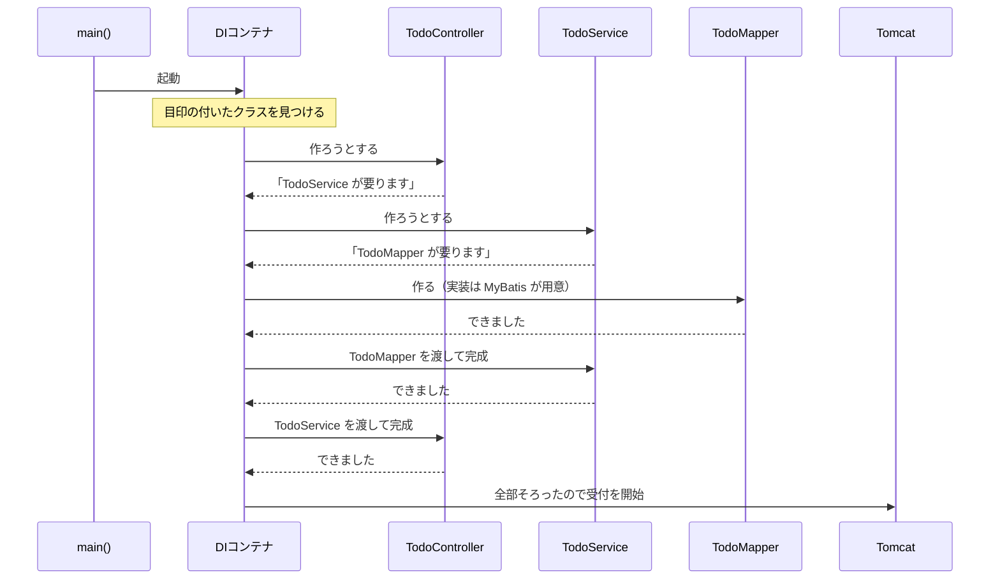

# フレームワークと O/R マッパー

> [!abstract] この章が終わったら
> - **フレームワーク**と **O/R マッパー**が、それぞれ何を肩代わりしてくれるかを説明できる
> - アプリを起動したとき、**誰がクラスを作って、誰が渡しているか**を説明できる
> - **DI（依存性注入）** が、前の章の「積み残した問題」の答えだと分かる
> - コンストラクタインジェクションを**自分で書ける**

---

## 1. フレームワーク ＝ 開発のひな形

**フレームワーク**とは、アプリを作るのに必要な土台と決まりごとを、あらかじめ用意してくれるものです。

今回使うのは **Spring Boot** です。

### 使わない場合、自分で書くもの

Web API を動かすには、本来こういうものが全部必要です。

- HTTP リクエストを受け付ける Web サーバーの起動と設定
- 「この URL が来たら、このクラスのこのメソッドを呼ぶ」という対応づけ
- 受け取った JSON を Java のオブジェクトに変換する処理
- DB 接続の管理
- そのほか大量の定型処理

### Spring Boot を使う場合

これらを Spring Boot が肩代わりします。**自分が書くのは中身だけ**になります。

| | 誰がやるか |
| :--- | :--- |
| Web サーバーの起動 | **Spring Boot**（Tomcat が内蔵されている） |
| URL とメソッドの対応づけ | **Spring Boot**（`@GetMapping` などの目印を見て判断） |
| JSON ⇔ Java オブジェクトの変換 | **Spring Boot** |
| DB 接続の管理 | **Spring Boot** |
| **業務としてやりたいこと** | **自分** |

前章の図で「太字になっているところは自分で書かない」と言ったのは、これのことです。

---

## 2. O/R マッパー ＝ Java と DB の翻訳係

Java は「**オブジェクト**」でデータを扱い、DB は「**テーブル（表）**」でデータを持ちます。
形が違うので、そのままでは繋がりません。

この差を埋めてくれるのが **O/R マッパー**（Object-Relational Mapper）です。
今回使うのは **MyBatis** です。

### 使わない場合、自分で書くもの

```
1. DB に接続する
2. SQL文（ただの文字列）を用意する
3. SQL を実行する
4. 結果を 1 行ずつループで取り出す
5. 各列の値を、Java オブジェクトのフィールドに 1 つずつ手でセットする
6. 接続を閉じる
```

カラムが 1 つ増えるだけで直す場所が増えます。

### MyBatis を使う場合

自分が用意するのは **2 つだけ**です。

1. **Mapper インターフェース** … 呼びたいメソッドを宣言する
2. **XML ファイル** … そのメソッドに対応する SQL を書く

```java
@Mapper
public interface TodoMapper {
    void insert(TodoEntity todoEntity);
}
```

接続・実行・結果の詰め替え・切断は、すべて MyBatis がやります。

> [!important] MyBatis は「実装クラス」を自分で作らせない
> 上のインターフェースには `implements` するクラスがありません。**書く必要がありません。**
> `@Mapper` を付けておけば、**MyBatis が実装を用意してくれます。**
>
> 前章 `§5-2` で「インターフェースの型で受け取る」という話をしました。
> Mapper はまさにその形になっています。

---

## 3. 起動したとき、何が起きているか

前章の積み残しはこれでした。

> `UserService` は `UserMapper` を自分で作らず、外から受け取る。**その「外」とは誰か。**

答えは **Spring Boot（DI コンテナ）** です。実際に起動して、順番を追ってみます。

### 3-1. 目印を探すところから始まる

アプリの入口はこれだけです。

```java
@SpringBootApplication
public class TodoApplication {
    public static void main(String[] args) {
        SpringApplication.run(TodoApplication.class, args);
    }
}
```

`@SpringBootApplication` が、**同じパッケージの下にあるクラスから目印を探します。**

| 目印 | 付ける先 | 意味 |
| :--- | :--- | :--- |
| `@RestController` | Controller | 受付窓口として管理してほしい |
| `@Service` | Service | 業務処理のクラスとして管理してほしい |
| `@Mapper` | Mapper インターフェース | MyBatis に実装を用意してほしい |

見つけたクラスは Spring が作って持っておきます。**この管理されているインスタンスを Bean と呼びます。**

### 3-2. 上から辿って、下から組み立てる ⚠️

ここが一番大事なところです。**DI コンテナは、下から順に作っていくのではありません。**



**依存を辿る向きは上から下、組み立てる向きは下から上。** この 2 つが逆なのが DI の姿です。

> [!example]- 実際の起動ログ（答えのコードを動かして確認したもの）
> `Creating`（作ろうとする）が Controller → Service → Mapper の順、
> `Autowiring`（渡す）がその逆順に並んでいます。
>
> ```
> 06.367  Tomcat initialized with port 8080
> 06.604  Creating shared instance of singleton bean 'todoController'   ┐
> 06.611  Creating shared instance of singleton bean 'todoService'      │ 上から辿る
> 06.613  Creating shared instance of singleton bean 'todoMapper'       ┘
> 06.617  Creating shared instance of singleton bean 'dataSource'
> 06.652  Creating shared instance of singleton bean 'sqlSessionTemplate'
> 06.904  Autowiring 'todoService'    via constructor to bean 'todoMapper'    ┐
> 06.906  Autowiring 'todoController' via constructor to bean 'todoService'   ┘ 下から組む
> 07.754  Tomcat started on port 8080
> 07.762  Started TodoApplication in 3.279 seconds
> ```
>
> MyBatis が Mapper の実装を用意しているところも、ログに出ています。
> ```
> MybatisAutoConfiguration : Searching for mappers annotated with @Mapper
> ClassPathMapperScanner   : Identified candidate component class: ...TodoMapper.class
> ```
>
> 確認環境：Spring Boot 3.4.1 / Java 21 / MyBatis Spring Boot Starter 3.0.4 / PostgreSQL 17.5

### 3-3. リクエストを受け付けるのは最後

上のログのとおり、**すべての Bean がそろってから** Tomcat がリクエストの受付を始めます。

だから、リクエストが届いた時点では **Controller も Service も Mapper も完成済み**です。
リクエストのたびにクラスを作り直しているわけではありません。

> [!note]- DB への接続はいつ張られるか
> `application.properties` に接続先が書いてあります。
> ```properties
> spring.datasource.url=jdbc:postgresql://localhost:5432/todo
> spring.datasource.username=todo
> spring.datasource.password=todo
> ```
> **起動時に読み込まれるのはこの設定です。** 実際の接続は、必要になったときに張られます。
> 接続先を変えたいときは、ここを直します。

---

## 4. DI（依存性注入）

ここまで見てきた仕組みに名前が付いています。

> [!important] 依存性注入（Dependency Injection, DI）
> **クラスが必要とするオブジェクトを、自分で作らず、外から与えてもらうこと。**
> 与える役をするのが **DI コンテナ**（Spring コンテナ）です。

前章の「積み残し」が、これで回収できました。

| 前章で言ったこと | この章での答え |
| :--- | :--- |
| 具体的なクラスを直接 `new` すると差し替えられない | `new` しない。外から受け取る |
| 「外から受け取る」の外とは誰か | **DI コンテナ** |
| Mapper のインターフェースの実装は誰が書くのか | **MyBatis** が用意する |

---

## 5. 書き方

### 5-1. 管理してもらう目印を付ける

```java
@RestController
public class TodoController { ... }

@Service
public class TodoService { ... }

@Mapper
public interface TodoMapper { ... }
```

### 5-2. コンストラクタの引数に書く

**必要なものは、コンストラクタの引数に型を書くだけ**です。Spring が対応する Bean を探して渡します。

```java
@RestController
@RequestMapping(path = "/todos")
public class TodoController {

    private final TodoService todoService;

    // 引数に書いておくと、Spring が TodoService を渡してくれる
    public TodoController(TodoService todoService) {
        this.todoService = todoService;
    }
}
```

```java
@Service
public class TodoService {

    private final TodoMapper todoMapper;

    public TodoService(TodoMapper todoMapper) {
        this.todoMapper = todoMapper;
    }
}
```

この書き方を **コンストラクタインジェクション** と言います。**課題ではこの形で書いてください。**

| 書くこと | 理由 |
| :--- | :--- |
| フィールドは `private final` | 作ったあとに差し替わらない |
| 受け取るのはコンストラクタ | 必要なものが揃わないとインスタンスを作れない |
| `new` は書かない | 何に依存しているかがコンストラクタを見れば分かる |

> [!note]- `@Autowired` について
> コンストラクタに `@Autowired` が付いたコードを見かけることがあります。
> 「このコンストラクタを DI に使う」と明示するためのものですが、
> **コンストラクタが 1 つだけなら省略できます。** 省略するのが今の主流です。

---

## 6. まとめ

| | 何を肩代わりするか | 自分が書くもの |
| :--- | :--- | :--- |
| **Spring Boot**（フレームワーク） | Web サーバー、URL の振り分け、JSON 変換、インスタンスの生成と受け渡し | 業務としてやりたいこと |
| **MyBatis**（O/R マッパー） | DB 接続、SQL 実行、結果の詰め替え | Mapper インターフェースと SQL |

```
起動
  ↓
@SpringBootApplication が目印（@RestController / @Service / @Mapper）を探す
  ↓
Controller を作ろうとする → Service が要る → Mapper が要る   （上から辿る）
  ↓
Mapper ができる → Service に渡す → Controller に渡す         （下から組む）
  ↓
全部そろったら Tomcat が受付開始
  ↓
リクエストが来たら、できあがった Controller が呼ばれる
```

ここまでが、課題に入る前に知っておいてほしいことです。
次からは実際にコードを書いていきます。
