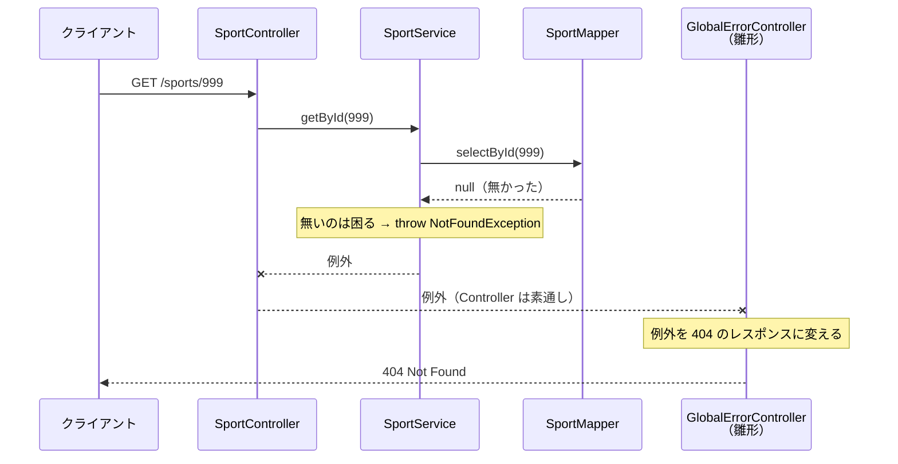

# 1件取得と例外

> [!abstract] この章が終わったら
> - URL のパスに入った ID を、**パスパラメータ**として受け取れる
> - 見つからなかったときに**自分で例外を投げて**、404 を返せる
> - 例外を「**どの層が投げて、どの層が受け止めるか**」を説明できる

この章で新しく出てくるのは 2 つだけです。**パスパラメータ**と、**例外を自分で投げること**。
それ以外（Controller → Service → Mapper の流れ）は、POST と同じです。

---

## 1. 作るもの：ID を指定した 1 件取得

例は前章に続いてスポーツです。

```
GET http://localhost:8080/sports/1
```

| 場合 | ステータス | ボディ |
| :--- | :--- | :--- |
| 見つかった | **200 OK** | `{"sportId":1,"name":"サッカー","playerCount":11,"version":0}` |
| 見つからなかった | **404 Not Found** | `{"title":"NOT_FOUND","status":404,"code":"notFound.resource","message":"Resource not found."}` |

tag の 1 件取得（`GET /tags/{tagId}`）も、API 設計書では同じ 200 と 404 の 2 つです。

**「見つからなかったら 404」は、誰かが書かないと起きません。** 何も書かなければ、200 で空のボディが返ります。
この「誰か」が自分で、それをどこに書くかがこの章の中心です。

---

## 2. パスパラメータを受け取る

`03_HTTPプロトコル` で見たパラメータの 3 種類のうち、URL のパスに値を埋め込むのが**パスパラメータ**です。

```
/sports/1       ← この 1 がパスパラメータ
/sports/2
/sports/15
```

### 2-1. Controller

```java
/**
 * スポーツの1件取得
 *
 * @param sportId URLのパスで指定されたスポーツID
 * @return 見つかったスポーツ
 */
@GetMapping(path = "/{sportId}")
public SportEntity getById(@PathVariable Integer sportId) {
    return sportService.getById(sportId);
}
```

| 書くもの | 意味 |
| :--- | :--- |
| `@GetMapping(path = "/{sportId}")` | `{ }` の部分に何が来てもこのメソッドで受ける。クラスの `/sports` とつながって `/sports/{sportId}` になる |
| `@PathVariable` | `{sportId}` に入っていた値を、この引数に入れる |
| 引数名 `sportId` | **`{ }` の中の名前と一致させる** |

戻り値の Entity は、Spring Boot が JSON に変換して 200 で返します。POST と違って `ResponseEntity` は要りません。

### 2-2. 型は `Integer` で受ける

URL は文字列ですが、`Integer` と書いておけば **Spring Boot が数値に変換して**渡してくれます。

```java
// これはしない
public SportEntity getById(@PathVariable String sportId) {
    return sportService.getById(Integer.parseInt(sportId));
}
```

`String` で受けて自分で `Integer.parseInt` するのは、Spring Boot がやってくれることを自分でやり直しているだけです。

> [!note]- `/sports/abc` のように数字でない値を送ると 500 になる
> `Integer` に変換できないので、Spring Boot が `MethodArgumentTypeMismatchException` を投げます。
> この例外を 400 に変える処理が今の雛形には無いので、500 が返ります。
> **自分のコードの不備ではありません。** `String` で受けて `parseInt` しても、同じく 500 になります。

---

## 3. Mapper：1 件だけ取る

```java
/**
 * IDを指定してスポーツを1件取得する
 *
 * @param sportId 取得するスポーツのID
 * @return 見つかったスポーツ。見つからなければnull
 */
SportEntity selectById(Integer sportId);
```

```xml
<select id="selectById" resultType="jp.aevic.todo.entity.sport.SportEntity">
    SELECT
        SPORT_ID,
        NAME,
        PLAYER_COUNT,
        VERSION
    FROM
        SPORT
    WHERE
        SPORT_ID = #{sportId}
</select>
```

- `resultType` … 取れた 1 行を、どのクラスに詰めるか
- 戻り値を `SportEntity` 1 つにすると、MyBatis は**見つからなかったとき `null` を返します**

> ⚠️ **値は `#{}` で埋め込む。`${}` は使わない**
> `${}` は値を SQL の文字列にそのまま貼り付けます。送られてきた値によっては、SQL そのものを書き換えられてしまいます（SQL インジェクション）。

---

## 4. 見つからなかったら、例外を投げる

### 4-1. Service

```java
/**
 * スポーツの1件取得
 *
 * @param sportId 取得するスポーツのID
 * @return 見つかったスポーツ
 */
public SportEntity getById(Integer sportId) {
    SportEntity sportEntity = sportMapper.selectById(sportId);

    // 見つからなければ、404にするための例外を投げる
    if (Objects.isNull(sportEntity)) {
        throw new NotFoundException(ErrorCodes.NOT_FOUND_RESOURCE);
    }
    return sportEntity;
}
```

`throw` した時点で、このメソッドは終わります。`return` までは進みません。

### 4-2. 使う例外は雛形に用意されている

例外クラスは自分で作りません。`core/exception/exception/` に用意されています。

| 例外クラス | 返るステータス |
| :--- | :--- |
| `BadRequestException` | 400 |
| `NotFoundException` | 404 |
| `OptimisticLockException` | 409 |
| `InternalErrorException` | 500 |

引数の `ErrorCodes` は、レスポンスの `code` と `message` を決めます。
**どの場面でどの例外・どのエラーコードを使うかは、エラー設計書（`03.API設計/エラー設計書/APIエラーコード.md`）に書いてあります。**
自分で選ばず、設計書から引いてください。

### 4-3. Controller には何も書き足さない

§2-1 の Controller は、**例外について何も書いていません。** `try-catch` も `if` もありません。
それでも 404 が返ります。**誰が 404 に変えているのか。** それが次の節です。

---

## 5. 誰が判断して、誰が受け止めるか

### 5-1. 会社に例えると

社長・上司・部下の 3 人がいます。社長は上司に「新しいシステムを作れ」と命じ、上司は部下に「このタスクをやれ」と命じます。
**命じることを、メソッドの呼び出しとして書くと**こうなります。

![[08_作図_例外はエスカレーション.excalidraw|900]]

- **命令＝メソッド呼び出し**（灰色の矢印）。上の人が、下の人のメソッドを呼びます
- **報告＝`throw`**（赤い矢印）。下の人が片づけられないことは、**呼び出し元に**投げ返します
- 投げ返された側は `catch` で受け止めます。片づけられれば片づけ、無理なら**相手に通じる言葉に直して**さらに上へ投げます

ここから読み取ってほしいのは次の 4 つです。

| # | ルール | 図の中では |
| :--- | :--- | :--- |
| ① | **自分で片づくことは、自分で片づける。** 例外にしない | 部下：PC を忘れた → 取りに帰る |
| ② | **自分の立場で判断できないことは、投げる** | 部下：PC が壊れた・やばいメール → throw |
| ③ | **受け取った側は、片づけられるなら片づけ、無理なら相手に通じる言葉に直して投げ直す** | 上司：PC は総務へ。やばいメールは「経営判断が必要」に直して社長へ |
| ④ | **一番上が、必ず最後に受け止める** | 社長 |

### 5-2. アプリでは

アプリの中でも、例外は**呼び出しを逆にたどって**上に上がっていきます。

| 層 | 例外について何をするか |
| :--- | :--- |
| **Mapper** | 探して、あった／無かった（`null`）を**そのまま返すだけ**。無いのが困ることかどうかは知らない |
| **Service** | 「その ID が無い」のは業務として困る、と**判断して `NotFoundException` を投げる** |
| **Controller** | 何もしない。**受け止めずに素通しする**（`try-catch` を書かない） |
| **雛形の `GlobalErrorController`** | 上がってきた例外を**最後に受け止めて、404 などのレスポンスに変える** |

最後に受け止める役は、もう雛形にいます。だから Controller には何も書かなくてよいのです。



> [!example]- 実際のログ（`GET /sports/999` を送ったとき）
> `NotFoundException` が Controller から出たあと、Spring Boot がリクエストを `/error` に回し直し、
> そこで雛形の `GlobalErrorController` が受け止めています。
> ```
> DispatcherServlet        : GET "/sports/999", parameters={}
> DefaultHandlerExceptionResolver : Resolved [jp.aevic.todo.core.exception.exception.NotFoundException: 404 NOT_FOUND, ...]
> DispatcherServlet        : "ERROR" dispatch for GET "/error", parameters={}
> MyExceptionLogger        : URI: /sports/999, method: GET, ... ErrorMessage: Resource not found.
> ```
> 確認環境：Spring Boot 3.4.1。`logging.level.org.springframework.web=DEBUG` を付けて起動したときのログ

### 5-3. なぜ Service が判断するのか

「無かったら 404」を Mapper や Controller に書かない理由です。

- **Mapper に書かない** … 「無い」ことが困るかどうかは、使う側で変わります。一覧取得なら、0 件は**空のリストを返すだけで正常**です。Mapper が勝手に例外を投げると、困らない場面で使えなくなります
- **Controller に書かない** … 「その ID のスポーツが無いと先に進めない」は業務のルールです（`05_なぜクラスを分けるのか` §2）。バッチなど HTTP 以外の入口から Service を呼んでも、同じ判断が効くようにしておきます
- **Service が投げるのは「404 を返せ」ではなく「見つからない」** … `NotFoundException` という名前のとおりです。それを HTTP の 404 に直すのは、最後に受け止める `GlobalErrorController` の仕事です

### 5-4. 前章のスタックトレースも「投げ直し」だった

`07_POST処理を作ってみよう` §9-2 のスタックトレースを思い出してください。`Caused by:` が何段も続いていました。
DB が投げた例外を MyBatis や Spring が受け取り、**自分の言葉に直して投げ直した**跡です（ルール ③）。
一番下の `Caused by:` が一番最初の報告なので、そこから読むと原因が分かります。

---

## 6. まとめ

| | 書くこと | 書かないこと |
| :--- | :--- | :--- |
| **Controller** | `@GetMapping(path = "/{id}")` と `@PathVariable Integer` で受け取る | `parseInt`、`try-catch`、見つからないときの判定 |
| **Service** | 見つからなければ `NotFoundException` を投げる | HTTP のステータスコード |
| **Mapper** | `#{}` で ID を渡して 1 件取る | 見つからないときの判定 |
| **雛形** | （例外を受け止めてレスポンスに変える。自分では書かない） | |

**例外は、判断できる層が投げて、一番上が受け止める。** 間の層は、片づけられないなら素通しにします。
